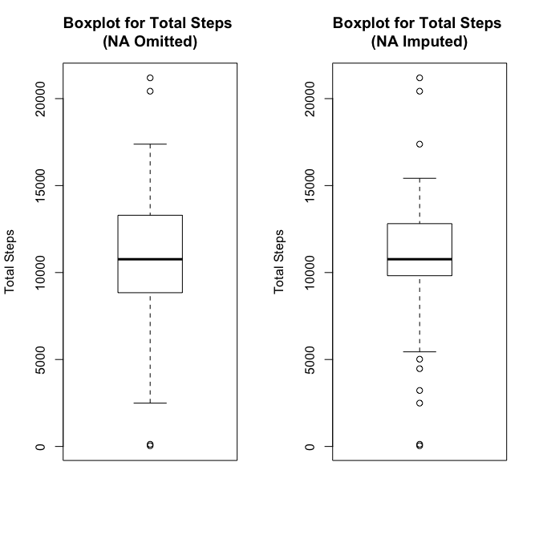
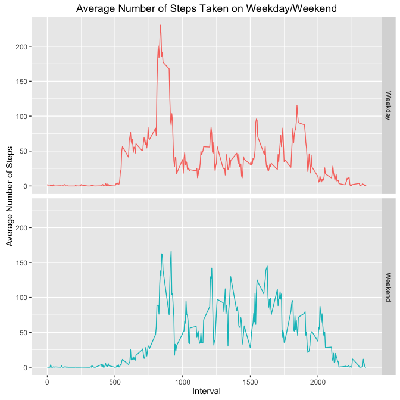

# Reproducible Research: Peer Assessment 1
Sean Krinik  


## Loading and preprocessing the data

```r
setwd("~/Documents/Docs/R Programming CourseEra/RepData_PeerAssessment1")
#Install necessary packages:
library(lubridate); library(dplyr); library(ggplot2); library(gridExtra); library(timeDate)
#assuming the raw data is within the current working directory:
unzip("activity.zip")
data <- read.csv("activity.csv")
data <- filter(data, !is.na(data$steps)) #Get rid of the NA values
```

## What is mean total number of steps taken per day?

```r
total_steps <- with(data, aggregate(steps, by = list(ymd(date)), sum))
total_steps <- rename(total_steps, Day = Group.1, Steps = x)
#
mean_med <- data.frame(mean(total_steps$Steps), as.numeric(median(total_steps$Steps)), row.names = "Steps")
names(mean_med) <-c("Mean of total steps", "Median of total steps")
mean_med
```

```
##       Mean of total steps Median of total steps
## Steps            10766.19                 10765
```

```r
#Plot
p <- ggplot(total_steps, aes(Steps))
p + geom_histogram(bins = length(total_steps$Day)) + 
    xlab("Total Steps") + ylab("Frequency") +
    ggtitle("Histogram of Total Steps Per Day") + guides(fill = F)
```


## What is the average daily activity pattern?

```r
daily_activity <- aggregate(steps~interval, data = data, mean)
paste("Maximum Average Steps in Interval: ", round(daily_activity[which.max(daily_activity$steps), ]$steps, digits = 2))
```

```
## [1] "Maximum Average Steps in Interval:  206.17"
```

```r
p1 <- ggplot(daily_activity, aes(x = interval, y = steps)) 
p1 + geom_line() + ggtitle("Daily Activity Time Series") + xlab("Interval Number") + ylab("Average Steps \n(per day, by interval)")
```


## Imputing missing values

```r
#Simply reload data with NA values now:
data_na <- read.csv("activity.csv")
na_values <- as.numeric(sum(is.na(data_na$steps))) #number of NA's
paste("Number of 'NA' Values: ", na_values) #Print to console
```

```
## [1] "Number of 'NA' Values:  2304"
```

```r
#Use the mean of each interval from the daily activity data set
na_vec <- which(is.na(data_na$steps)) #get indicies of NA values in dataset
new_data <- replace(data_na$steps,na_vec,daily_activity[match(data_na$interval, daily_activity$interval), ]$steps) #replace the indicies of NA values with the matched intervals from the daily_activity data frame that has the daily means.
```

```
## Warning in replace(data_na$steps, na_vec, daily_activity[match(data_na
## $interval, : number of items to replace is not a multiple of replacement
## length
```

```r
mean_na_data <- mutate(data_na, steps = new_data) #steps column now has replaced data in steps column

# test NA's
table(is.na(mean_na_data$steps))
```

```
## 
## FALSE 
## 17568
```

```r
# FALSE :: 17568 

# Recalculate Totals with new data set:
total_imputed <- with(mean_na_data, aggregate(steps, by = list(ymd(date)), sum))
total_imputed <- rename(total_imputed, Day = Group.1, Steps = x)

#Histogram with imputed missing data:
p <- ggplot(total_imputed, aes(Steps))
p + geom_histogram(bins = length(total_imputed$Day)) + 
    xlab("Total Steps") + ylab("Frequency") +
    ggtitle("Histogram of Total Steps Per Day \nWith Mean Imputed NA Values ") + guides(fill = F)
```




## Are there differences in activity patterns between weekdays and weekends?

```r
daily_activity_wk <- mutate(mean_na_data, weekday = date)
daily_activity_wk$weekday <- isWeekday(as.timeDate(daily_activity_wk$weekday))
daily_activity_wk <- aggregate(steps~interval+weekday, data = daily_activity_wk, mean)
daily_activity_wk$weekday <- factor(daily_activity_wk$weekday, levels = c(TRUE, FALSE), labels = c("Weekday", "Weekend"))

p2 <- ggplot(daily_activity_wk, aes(x = interval, y = steps))
p2 + facet_grid(.~weekday) + geom_line(aes(color = weekday), show.legend = F) + guides(fill = F)+ ggtitle("Average Number of Steps Taken on Weekday/Weekend") + xlab("Interval") + ylab("Average Number of Steps")
```



